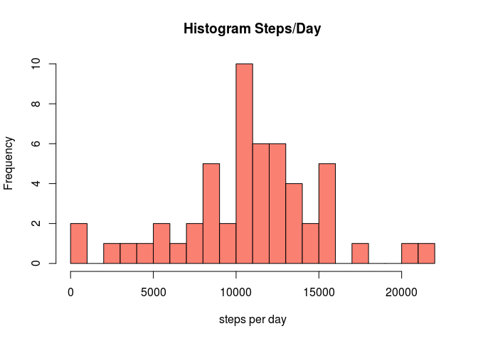
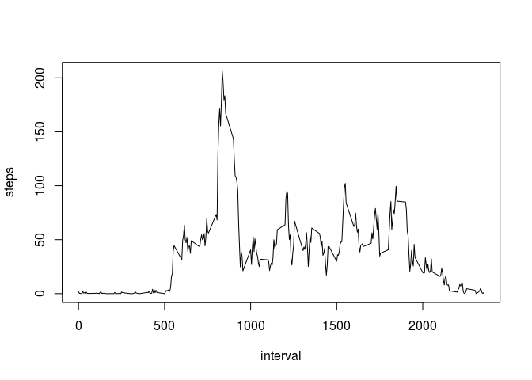
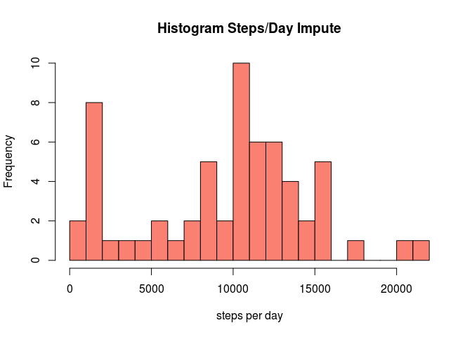
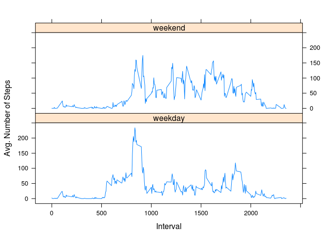

# Reproducible Research: Peer Assessment 1


## Loading and preprocessing the data

Data is loaded from the activity monitoring data set, which is included in the project (must be unzipped)


```r
activity <- read.csv("activity.csv")
head(activity)
```

```
##   steps       date interval
## 1    NA 2012-10-01        0
## 2    NA 2012-10-01        5
## 3    NA 2012-10-01       10
## 4    NA 2012-10-01       15
## 5    NA 2012-10-01       20
## 6    NA 2012-10-01       25
```

One thing to note is the encoding of the interval value.  If leading zeros are added to the number, then theh 4 digit number may be interpreted as HHMM, where HH is from 00-23 and MM is from 00-59.


## What is mean total number of steps taken per day?

For the initial evaluation, missing values are ignored in the data set.  A cleaned data set is generated with the incomplete records removed.  Then the total number of steps per day are calculated.


```r
activity.clean <- activity[complete.cases(activity),]
steps.per.day <- aggregate(steps ~ date, data = activity.clean, sum)
dim(steps.per.day)
```

```
## [1] 53  2
```
The distribution of the total steps per day can be visualized in a histogram.


```r
hist(steps.per.day$steps, 20, xlab = "steps per day", main = "Histogram Steps/Day", col="salmon")
```

 

The distribution has a peak around 11000 steps/day and falls off from there.  Looking at the mean and median values confirm that this peak is close the middle of the distribution.


```r
mean(steps.per.day$steps)
```

```
## [1] 10766.19
```

```r
median(steps.per.day$steps)
```

```
## [1] 10765
```

## What is the average daily activity pattern?

To examine the average daily activity pattern, we calculate the average steps taken in each 5 minute interval across all days.  Here we again ignore missing values.


```r
steps.per.interval <- aggregate(steps ~ interval, data = activity.clean, mean)
with(steps.per.interval, plot(interval, steps, type = "l"))
```

 

The 5 minute interval that has the largest number of steps:


```r
with(steps.per.interval, max(steps))
```

```
## [1] 206.1698
```

```r
idx <- with(steps.per.interval, which.max(steps))
steps.per.interval[idx,]
```

```
##     interval    steps
## 104      835 206.1698
```

The maximum average number of steps in a 5 minute interval is just over 206, which corresponds to the 104th interval of the day.  The interval identifier is 835, which corresponds to the time interval from 08:35:00 AM to 08:39:59 AM.

## Imputing missing values

A number of the data records contain missing values.  We generate a vector to flag these records and then count the number of missing values.


```r
idx.na <- is.na(activity)
sum(idx.na)
```

```
## [1] 2304
```

In order to assess whether the missing values may introduce bias into the calculations, we impute the missing values.  The impute strategy will be to fill in the missing values with the average number of steps over the same time interval.


```r
# copy data to new variable
activity.impute <- activity

# assign new value to all the "steps" that had missing values
# the new values are taken from the average number of steps/interval (column 2 in 
# steps.per.interval)
activity.impute[idx.na,1] <- steps.per.interval[activity.impute[idx.na,3] + 1, 2]
```

The histrogram of the steps/per day given the imputed values can now be generated.


```r
steps.per.day2 <- aggregate(steps ~ date, data = activity.impute, sum)
hist(steps.per.day2$steps, 20, xlab = "steps per day", main = "Histogram Steps/Day Impute", col="salmon")
```

 

The mean and medians are in fact slightly different.


```r
mean(steps.per.day2$steps)
```

```
## [1] 9546.242
```

```r
median(steps.per.day2$steps)
```

```
## [1] 10395
```

The total daily steps are slightly lower.  This effect is also shown in the histogram with a higher frequencies for lower steps/day (leftward tail).

## Are there differences in activity patterns between weekdays and weekends?

In order to examine whether there are differences in activity patterns between weekdays and weekends, a new factor variable is added to categorize whether it is a weekday or not.  Note: this analysis is performed using the imputed data.


```r
wkend <- weekdays(as.Date(activity.impute$date)) %in% c("Saturday", "Sunday")
activity.impute$daytype <- as.factor(ifelse(wkend, "weekend", "weekday"))
head(activity.impute)
```

```
##       steps       date interval daytype
## 1 1.7169811 2012-10-01        0 weekday
## 2 2.0943396 2012-10-01        5 weekday
## 3 0.3018868 2012-10-01       10 weekday
## 4 0.3396226 2012-10-01       15 weekday
## 5 0.1698113 2012-10-01       20 weekday
## 6 0.0000000 2012-10-01       25 weekday
```

The average number of steps/interval is calculated in the imputed data and a panel plot of the average steps vs. interval for weekdays and weekends is generated.


```r
library(lattice)
steps.per.interval2 <- aggregate(steps ~ interval + daytype, data = activity.impute, mean)
xyplot(steps ~ interval | daytype, steps.per.interval2, type = "l", xlab = "Interval", ylab="Avg. Number of Steps", layout=c(1,2))
```

 

One observation is that on weekdays, there seems to be significant activity 5:00 AM and 7:00 AM, whereas there is almost none on weekends.  This likely corresponds to people preparing to get to work and school.  On weekdays, there is also a large amount of activity in the 8:00 AM to 9:00 AM periods.  This could correspond to people walking to the office or school.


